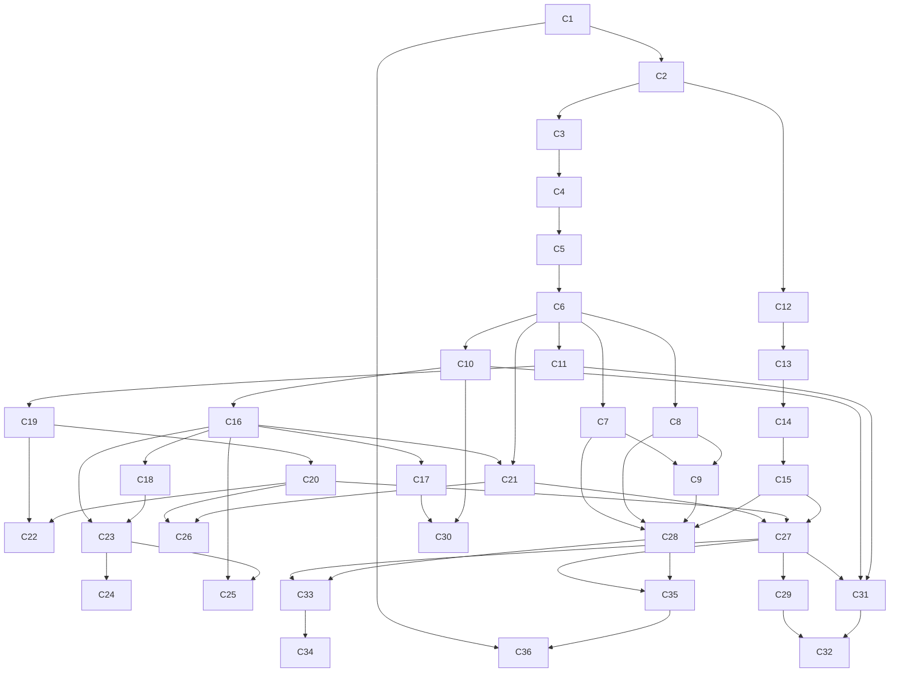

# Concept Map: Church Bookkeeping

**Target capability:** Keep accurate, transparent financial records for a small reformed Baptist
church in Accra, Ghana — recording transactions weekly, reconciling the bank monthly, producing
reports for the elders monthly and the congregation annually.

**Field(s):** Non-profit / church bookkeeping; fund accounting; financial stewardship

**Based on:** RESOURCES.md (as of 2026-06-26)

---

## Concepts

### Module 1 — Foundations

- **C1 · Purpose of church bookkeeping** — Why records matter: stewardship (the money belongs to
  God and the congregation), accountability (to elders and members), and protection (accurate
  records shield the church and the bookkeeper from accusation). _Prereqs:_ none. _Status:_ needed.
  _Source:_ [Foundation Group](https://www.501c3.org/bookkeeping-for-churches/);
  [Shepherd Thoughts](https://www.shepherdthoughts.com/baptistchurchny/deacons-in-the-church-financial-stewardship-and-voluntary-activity/)

- **C2 · Church vs. business accounting** — Businesses track profit; churches track stewardship.
  The goal is not surplus but faithful management of designated money. Fund accounting replaces
  profit/loss as the organising principle. _Prereqs:_ C1. _Status:_ needed.
  _Source:_ [Jitasa Ultimate Guide](https://www.jitasagroup.com/jitasa_nonprofit_blog/church-accounting-guide/);
  [Free Church Accounting](https://www.freechurchaccounting.com/accounting-for-churches.html)

- **C3 · The accounting equation** — Assets = Liabilities + Net Assets (fund balance). Every
  transaction keeps this equation balanced. "Net assets" replaces "equity" for nonprofits.
  _Prereqs:_ C2. _Status:_ needed.
  _Source:_ [BooksTime](https://www.bookstime.com/articles/accounting-for-churches)

- **C4 · Double-entry bookkeeping** — Every transaction touches two accounts in equal and
  opposite amounts; the books always balance. Single-entry (cash book only) is simpler but hides
  errors and cannot produce a balance sheet. _Prereqs:_ C3. _Status:_ needed.
  _Source:_ [Free Church Accounting](https://www.freechurchaccounting.com/accounting-for-churches.html)

- **C5 · Debits and credits** — Debit = left side of an account; credit = right side. Assets and
  expenses increase with debits; liabilities, net assets, and income increase with credits.
  _Prereqs:_ C4. _Status:_ needed.
  _Source:_ [Free Church Accounting](https://www.freechurchaccounting.com/accounting-for-churches.html)

---

### Module 2 — Chart of Accounts & Fund Accounting

- **C6 · Chart of accounts** — The master numbered list of every account category the church uses
  to classify money; the skeleton of the whole bookkeeping system. _Prereqs:_ C5. _Status:_ needed.
  _Source:_ [Jitasa Chart of Accounts Template](https://www.jitasagroup.com/nonprofit-resources/nonprofit-free-downloads/church-chart-of-accounts-template/)

- **C7 · Asset accounts** — Cash in hand, bank balance, petty cash, and anything else the church
  owns. These are the first accounts in the chart. _Prereqs:_ C6. _Status:_ needed.
  _Source:_ [Jitasa Ultimate Guide](https://www.jitasagroup.com/jitasa_nonprofit_blog/church-accounting-guide/)

- **C8 · Liability accounts** — Bills unpaid (accounts payable), deposits held. Things the church
  owes. _Prereqs:_ C6. _Status:_ needed.
  _Source:_ [Jitasa Ultimate Guide](https://www.jitasagroup.com/jitasa_nonprofit_blog/church-accounting-guide/)

- **C9 · Net assets / fund balance** — What remains after subtracting liabilities from assets;
  the church's "equity." May be unrestricted or restricted. _Prereqs:_ C7, C8. _Status:_ needed.
  _Source:_ [BooksTime](https://www.bookstime.com/articles/accounting-for-churches)

- **C10 · Income accounts** — Tithes, weekly offerings, special collections, designated gifts,
  hall rental (if any). Each is a separate account so trends are visible. _Prereqs:_ C6.
  _Status:_ needed.
  _Source:_ [Jitasa Ultimate Guide](https://www.jitasagroup.com/jitasa_nonprofit_blog/church-accounting-guide/)

- **C11 · Expense accounts** — Rent/mortgage, utilities, supplies, ministry activities, transport,
  printing, benevolence payments. Each is a separate account. _Prereqs:_ C6. _Status:_ needed.
  _Source:_ [Jitasa Chart of Accounts Template](https://www.jitasagroup.com/nonprofit-resources/nonprofit-free-downloads/church-chart-of-accounts-template/)

- **C12 · What a fund is** — A ring-fenced pool of money with a defined purpose; the envelope
  the congregation understood their gift would go into. _Prereqs:_ C2. _Status:_ needed.
  _Source:_ [ChurchTrac Fund Accounting](https://www.churchtrac.com/blog/fund-accounting-for-churches)

- **C13 · The General Fund** — The unrestricted operational fund that pays day-to-day expenses;
  where tithes and undesignated offerings go. _Prereqs:_ C12. _Status:_ needed.
  _Source:_ [ChurchTrac Fund Accounting](https://www.churchtrac.com/blog/fund-accounting-for-churches)

- **C14 · Restricted funds** — Building Fund, Missions Fund, Benevolence Fund. Money given for
  a specific purpose that cannot legally or ethically be spent elsewhere. _Prereqs:_ C12, C13.
  _Status:_ needed.
  _Source:_ [ChurchTrac Fund Accounting](https://www.churchtrac.com/blog/fund-accounting-for-churches)

- **C15 · Tracking fund balances separately** — Why you need separate columns or accounts for
  each fund; mixing them is both an ethical failure and a bookkeeping error. _Prereqs:_ C13, C14.
  _Status:_ needed.
  _Source:_ [Jitasa Ultimate Guide](https://www.jitasagroup.com/jitasa_nonprofit_blog/church-accounting-guide/)

---

### Module 3 — Recording Transactions

- **C16 · Offering count procedure** — Two people count together immediately after the service,
  sign the count sheet, and both retain a copy. No offering leaves without a written record.
  _Prereqs:_ C10. _Status:_ needed.
  _Source:_ [Mississippi Baptist Guidebook](https://mbcb.org/wp-content/uploads/2023/02/church-finanical-guidebook-resource.pdf)

- **C17 · Giving record** — A per-member log of amounts given (date, amount, fund); the basis
  for annual contribution statements. _Prereqs:_ C16. _Status:_ needed.
  _Source:_ [Donorbox](https://donorbox.org/nonprofit-blog/accounting-for-churches)

- **C18 · Bank deposits** — All collected funds deposited intact (not used for expenses first);
  deposit slip kept as the link between the count sheet and the bank. _Prereqs:_ C16. _Status:_ needed.
  _Source:_ [Mississippi Baptist Guidebook](https://mbcb.org/wp-content/uploads/2023/02/church-finanical-guidebook-resource.pdf)

- **C19 · Expense receipts and vouchers** — Every payment must be accompanied by a receipt or
  payment voucher, approved before payment. No receipt = no payment. _Prereqs:_ C11. _Status:_ needed.
  _Source:_ [Mississippi Baptist Guidebook](https://mbcb.org/wp-content/uploads/2023/02/church-finanical-guidebook-resource.pdf)

- **C20 · Cash disbursements journal** — The chronological record of every payment: date, payee,
  amount, account charged, fund. _Prereqs:_ C19, C6. _Status:_ needed.
  _Source:_ [Free Church Accounting Spreadsheets](https://www.freechurchaccounting.com/freespreadsheets.html)

- **C21 · Cash receipts journal** — The chronological record of every amount received: date,
  source, amount, account credited, fund. _Prereqs:_ C16, C6. _Status:_ needed.
  _Source:_ [Free Church Accounting Spreadsheets](https://www.freechurchaccounting.com/freespreadsheets.html)

- **C22 · Petty cash** — A small float (e.g. GHS 200) for minor cash expenses; managed with a
  petty cash log and receipts; replenished by cheque when low. _Prereqs:_ C19, C20. _Status:_ needed.
  _Source:_ [Jitasa Bookkeeping Guide](https://www.jitasagroup.com/jitasa_nonprofit_blog/church-bookkeeping/)

---

### Module 4 — Internal Controls

- **C23 · Segregation of duties** — The person who collects money should not also record it and
  should not have sole access to the bank; split these roles across people. _Prereqs:_ C16, C18.
  _Status:_ needed.
  _Source:_ [Mississippi Baptist Guidebook](https://mbcb.org/wp-content/uploads/2023/02/church-finanical-guidebook-resource.pdf);
  [Methodist Ghana Study](https://www.researchgate.net/publication/305816575_Accountability_and_internal_control_in_religious_organisations_a_study_of_Methodist_church_Ghana)

- **C24 · Authorization levels** — Define in writing who can approve payments of different sizes
  (e.g. under GHS 500: bookkeeper; GHS 500–2000: one elder; above GHS 2000: full elders'
  meeting). _Prereqs:_ C23. _Status:_ needed.
  _Source:_ [Mississippi Baptist Guidebook](https://mbcb.org/wp-content/uploads/2023/02/church-finanical-guidebook-resource.pdf)

- **C25 · The two-person counting rule** — Never count offerings alone; never leave counted money
  unattended before banking. _Prereqs:_ C16, C23. _Status:_ needed.
  _Source:_ [Foundation Group](https://www.501c3.org/bookkeeping-for-churches/)

- **C26 · Bank reconciliation** — Monthly process of matching the ledger's bank account balance
  to the actual bank statement, identifying and resolving every difference. _Prereqs:_ C20, C21.
  _Status:_ needed.
  _Source:_ [Jitasa Bookkeeping Guide](https://www.jitasagroup.com/jitasa_nonprofit_blog/church-bookkeeping/)

---

### Module 5 — Financial Reports

- **C27 · Statement of Activities** — The church's income-and-expenditure report for a period:
  total income by category, total expenses by category, and net change per fund.
  The equivalent of a profit/loss statement. _Prereqs:_ C21, C20, C15. _Status:_ needed.
  _Source:_ [BooksTime](https://www.bookstime.com/articles/accounting-for-churches);
  [Donorbox](https://donorbox.org/nonprofit-blog/accounting-for-churches)

- **C28 · Statement of Financial Position** — A snapshot of what the church owns (assets) and
  owes (liabilities), showing the net assets by fund at a specific date.
  The equivalent of a balance sheet. _Prereqs:_ C7, C8, C9, C15. _Status:_ needed.
  _Source:_ [Aplos Balance Sheet Template](https://www.aplos.com/academy/free-church-balance-sheet-template-excel-google-sheets);
  [BooksTime](https://www.bookstime.com/articles/accounting-for-churches)

- **C29 · Budget vs. actual report** — A side-by-side comparison of budgeted income/expenses
  against actuals for the period; the primary tool for monthly elder reporting. _Prereqs:_ C27.
  _Status:_ needed.
  _Source:_ [Jitasa Ultimate Guide](https://www.jitasagroup.com/jitasa_nonprofit_blog/church-accounting-guide/)

- **C30 · Member contribution statements** — An annual (or quarterly) record given to each
  member showing total amounts they gave and to which fund. _Prereqs:_ C17, C10. _Status:_ needed.
  _Source:_ [Donorbox](https://donorbox.org/nonprofit-blog/accounting-for-churches)

---

### Module 6 — Budgeting

- **C31 · Annual budget process** — How to estimate next year's income (based on giving trends)
  and expenses (based on prior year + known changes), present it to the elders, and get it
  adopted before the financial year begins. _Prereqs:_ C27, C10, C11. _Status:_ needed.
  _Source:_ [Mississippi Baptist Guidebook](https://mbcb.org/wp-content/uploads/2023/02/church-finanical-guidebook-resource.pdf)

- **C32 · Budget monitoring and variance** — Reading the budget vs. actual report each month:
  what is underspent, overspent, or off-track on income, and what to do about it. _Prereqs:_ C29, C31.
  _Status:_ needed.
  _Source:_ [Jitasa Ultimate Guide](https://www.jitasagroup.com/jitasa_nonprofit_blog/church-accounting-guide/)

---

### Module 7 — Ghana Context & Governance

- **C33 · GRA charitable organisation status** — What tax exemptions religious organisations
  can claim in Ghana, and the annual filing obligations to the GRA. _Prereqs:_ C27, C28.
  _Status:_ needed.
  _Source:_ [GRA Practice Note on Charitable Organisations](https://gra.gov.gh/wp-content/uploads/2020/09/Practice-Note-on-Charitable-Organisation.pdf)

- **C34 · Annual returns to Companies Registry** — A church registered as a Company Limited by
  Guarantee must file annual returns and audited accounts within 18 months of incorporation and
  annually thereafter. _Prereqs:_ C33. _Status:_ needed.
  _Source:_ [Firmus Advisory](https://firmusadvisory.com/register-ngo-in-ghana/)

- **C35 · Congregational financial reporting** — How to present the annual accounts at the AGM:
  what to show, how to explain it in plain language, and what questions to expect. _Prereqs:_ C27, C28.
  _Status:_ needed.
  _Source:_ [Mississippi Baptist Guidebook](https://mbcb.org/wp-content/uploads/2023/02/church-finanical-guidebook-resource.pdf)

- **C36 · The deacon's fiduciary duty** — The biblical basis (Acts 6, 1 Tim 3) and practical
  meaning of a deacon's responsibility for church funds; what accountability looks like in
  practice. _Prereqs:_ C1, C35. _Status:_ needed.
  _Source:_ [Shepherd Thoughts](https://www.shepherdthoughts.com/baptistchurchny/deacons-in-the-church-financial-stewardship-and-voluntary-activity/)

---

## Modules (clusters)

- **M1 · Foundations** — C1, C2, C3, C4, C5
- **M2 · Chart of Accounts & Fund Accounting** — C6, C7, C8, C9, C10, C11, C12, C13, C14, C15 _(needs M1)_
- **M3 · Recording Transactions** — C16, C17, C18, C19, C20, C21, C22 _(needs M2)_
- **M4 · Internal Controls** — C23, C24, C25, C26 _(needs M3)_
- **M5 · Financial Reports** — C27, C28, C29, C30 _(needs M3, M4)_
- **M6 · Budgeting** — C31, C32 _(needs M5)_
- **M7 · Ghana Context & Governance** — C33, C34, C35, C36 _(needs M5)_

---

## Dependency graph

## Gaps

- No freely available worked example of a **Ghanaian church annual accounts** in GHS was found.
  The capstone lesson will build one from scratch using the concepts taught.
- Whether this specific church is **registered as a Company Limited by Guarantee** (or operates
  under the Ghana Baptist Convention's umbrella) affects Module 7. Confirm with the elders before
  the Module 7 lessons.
