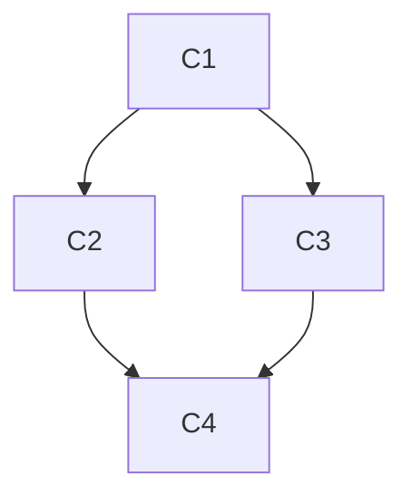

# CONCEPT-MAP.md Format

`CONCEPT-MAP.md` is the **map of the whole domain** for the target capability: every key concept the user needs, and the dependencies between them. It is the backbone the curriculum is built from — so it is the one artifact allowed to be comprehensive. Build it in Phase 2, grounded in `RESOURCES.md`, never from parametric guessing.

## Template

```md
# Concept Map: {Capability}

**Target capability:** {the concrete thing the user will be able to do}
**Field(s):** {the domain(s) this capability belongs to}
**Based on:** RESOURCES.md (as of {date})

## Concepts
One line each. Format: `**C{n} · {Name}**` — {what it is, one sentence}. _Prereqs:_ {ids or none}. _Status:_ {needed | optional | have-already}. _Source:_ {link to a RESOURCES.md entry}.

- **C1 · {Name}** — {one-sentence definition}. _Prereqs:_ none. _Status:_ needed. _Source:_ [..]
- **C2 · {Name}** — {one-sentence definition}. _Prereqs:_ C1. _Status:_ needed. _Source:_ [..]
- **C3 · {Name}** — {one-sentence definition}. _Prereqs:_ C1. _Status:_ have-already. _Source:_ [..]
- …

## Modules (clusters)
Group concepts into coherent modules — the seeds of curriculum modules. Note inter-module dependencies.

- **M1 · {Module name}** — C1, C2
- **M2 · {Module name}** — C3, C4  _(needs M1)_
- …

## Dependency graph (optional but recommended)
A Mermaid graph of prerequisite edges renders on GitHub and makes the path obvious:



## Gaps
Concepts you suspect matter but for which no trusted source was found. This drives the next round of resource-gathering.
```

## Rules

- **Cite every concept.** Each concept points to a `RESOURCES.md` entry. If you cannot source it, it goes in **Gaps**, not in the list.
- **Dependencies are the point.** The prerequisite edges are what let you order a sound curriculum. Be explicit and honest about what must come before what.
- **Prune what they have.** Mark concepts the user already demonstrated (from the interview or `learning-records/`) as `have-already` so the curriculum can skip them.
- **One sentence per concept.** This is a map, not the lessons. Resist explaining here — that is the lesson's job.
- **Core vs optional.** Mark concepts that are nice-to-have as `optional` so the curriculum can defer or drop them to protect scope.
- **It may be large — that is fine.** This is the single comprehensive artifact. The curriculum, lessons, and reference docs all stay lean by leaning on it.
- **Revise as the domain clarifies.** When teaching reveals the map was wrong or incomplete, update it (and the curriculum), and log a learning record.
